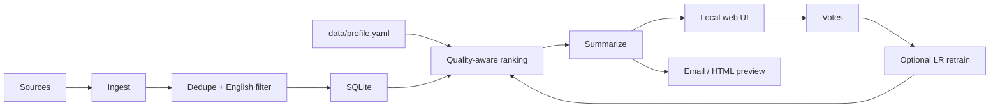

# DailyDigest

DailyDigest is a personalized morning research and news digest. It pulls from journals, preprint servers, biotech industry feeds, regulatory sources, and world news; ranks everything against your profile; summarizes the best items; and gives you a calm local UI for reading and feedback.

It is built for researchers who want signal without opening 40 tabs before breakfast.

**Status:** public-release hardened local app. Verified with `407` passing tests plus a live local web smoke test. See [docs/STATUS.md](docs/STATUS.md).

## Features

- One-command local web app with `./scripts/start.sh`
- First-run setup wizard for name, 1–10 weighted research interests, downweights, digest size, and summarizer backend
- Broad source coverage: journals, bioRxiv/medRxiv/arXiv, PubMed/OpenAlex, FDA/ClinicalTrials.gov, biotech news, and world news
- Profile-aware ranking with local embeddings, source-quality boosts, novelty signals, freshness gates, cross-source dedupe, anti-promo penalties, and source-balance caps
- Interest facet weights in `data/profile.yaml` so you can strengthen or soften topics without editing code
- Rank-feature snapshots, top-journal audit, and brew diagnostics so you can see when high-quality candidates were considered, filtered, or deduped
- SQLite embedding cache so repeated brews only embed new or changed items
- Graphical digest overview with scanned/selected counts, confidence-aware must-read cards, source-mix bars, diagnostic drawers, structured summaries, and per-item ranking signals
- Reader filters for priority, unread, published journals, preprints, AI/CS, and digest sections
- `Relevant` / `Seen` / `Not for me` feedback saved instantly, with optional toggleable reason chips like `Low impact`, `Promo`, `Access`, and `Duplicate`
- Optional learned ranking after enough Relevant/Not-for-me votes from the UI or `uv run dd vote --train`
- Extractive summaries by default, with optional OpenAI-compatible API, Claude Code CLI, or Codex CLI backends
- Dry-run HTML previews and optional Resend email delivery
- Local-first safety: loopback-only web server, CSRF-protected write routes, escaped templates, ignored user profile/data

## Quickstart

Pick whichever matches how comfortable you are with a terminal. All three end at
the same place: open `http://127.0.0.1:8765`, where a first-run setup wizard
writes your profile to `data/profile.yaml` and starts a dry-run brew. The
default install is lightweight — no PyTorch, ~400 MB.

**A. Docker (least setup — no Python needed).** Install [Docker Desktop](https://www.docker.com/products/docker-desktop/)
(macOS / Windows / Linux; on Windows it sets up the WSL2 backend for you), then:

```bash
docker compose up --build
```

**B. Double-click (macOS).** In Finder, open the `scripts` folder and double-click
`DailyDigest.command`. It installs `uv` on first run and launches the app.
(If macOS blocks it: right-click → Open.)

**C. One command (Linux / macOS / Windows-WSL).** Installs `uv` if missing, then launches:

```bash
git clone <your-repo-url>
cd dailydigest
bash scripts/install.sh
```

Already have `uv`? Just run `./scripts/start.sh`. Run headless with
`NO_BROWSER=1 ./scripts/start.sh`.

> Windows note: native Windows is not supported directly — use **Docker** (option A,
> smoothest) or install **WSL2** and use option C inside your Linux distro.

For an arbitrary HuggingFace encoder (SPECTER2, MedCPT, bge-large), add the extra:
`uv sync --extra hf` (this one pulls in PyTorch).

## Usage Tutorial

### First run

1. Start the app (`./scripts/start.sh`, double-click `DailyDigest.command`, or `docker compose up`).
2. On the setup screen, add **1–10 specific research interests** and a relative weight for each (for example, `protein design | 18`). These define what gets retrieved and ranked; weights are preferences, not quotas. Be specific rather than broad (e.g. "lipid nanoparticle delivery", not "biology").
3. Choose the **`Extractive`** summarizer for the easiest first run — no login or API key, fully offline. You can switch to an LLM backend later (see *Summarizer Backends*).
4. Click **`Brew my morning cup of tea`**. The first brew downloads the small embedding model (~130 MB) and takes a couple of minutes; later brews are faster (embeddings are cached).
5. Read the **`Must read first`** cards, then scan each section (Research / Industry / Regulatory / World).

#### Choosing interest weights

Enter one interest per line using `topic | weight`:

```text
protein engineering and design | 18
RNA nanotechnology | 15
gene and RNA therapeutics | 10
```

Use any positive weights up to 100. Only their ratios matter: `18, 15, 10` has
the same meaning as `36, 30, 20`. A higher weight gently favors that interest
among papers that already passed the relevance and quality gates. It is not a
percentage of the digest and does not reserve a daily slot.

Keep the list to ten or fewer specific research areas. Put peripheral subjects
you merely want to monitor in the bio or edit `context_keywords` in the profile
rather than making every related field a core interest.

### The daily loop (this is what makes it good)

6. As you read, give feedback on each item. The four levels carry different strength:

   | Button | Meaning | Effect |
   |---|---|---|
   | **Must read** | strongly wanted | strongest positive pull |
   | **Relevant** | wanted | positive |
   | **Hmmm** | mild / unsure | weak negative |
   | **Not for me** | unwanted | strong negative |

   Add a **reason chip** (`Low impact`, `Promo`, `Access`, `Duplicate`) after a negative to say *why* — the reason generalizes softly to similar future items.

7. Feedback is applied on your **next brew** automatically — the learned ranker retrains whenever there are new votes (you can also force it with `Update my ranking` or `uv run dd vote --train`).

**How feedback shapes future digests:** the ranker learns *which papers you actually like* from your votes, not just topic keywords. If you keep marking a broadly on-topic subtopic *Not for me* (say, LNP-delivery papers) while liking another (say, protein redesign), it learns to **suppress the first and surface the second** — even though both match your profile. This kicks in after ~30 signed votes; before that it ranks on topic + quality alone. The more you vote, the sharper it gets.

### Everyday commands

```bash
uv run dd run-all --dry-run   # brew a digest to an HTML file (no email)
uv run dd run-all             # brew + send email (needs RESEND_API_KEY, DIGEST_TO)
uv run dd vote --train        # retrain the learned ranker from your votes
uv run dd eval                # measure ranking quality against your vote history
```

## Ranking Quality

DailyDigest balances personal topic fit with editorial quality. Top journals still help as a tie-breaker, but a weakly matched Nature or Science item should not beat a substantially better match from a less prestigious venue. Ranking candidates are freshness-filtered, deduped across sources while keeping the best publisher/high-quality representative, and checked for promotional wording and low-information commentary so stale items, repeated papers, press-release-style posts, and editorials without new methods/results are pushed below independent, substantive coverage.

You can tune source hints in `config/sources.yaml` with `quality_tier`, `prestige_score`, `impact_floor`, and `promo_risk`. Exact impact factors are not fetched during brewing; the app uses stable local tiers to stay fast and reproducible.

Your private, ignored `data/profile.yaml` is created by setup and can be reset for a new user. It stores the weighted facets:

```yaml
canonical_facets:
  RNA nanotechnology:
    anchors: [RNA nanotechnology]
    priority: 17
  DNA nanotechnology:
    anchors: [DNA nanotechnology]
    priority: 15
```

Priorities are relative and influence only selection among already-qualified candidates. They do not guarantee a fixed number of slots or let weak papers bypass relevance gates.

### Edit, reset interests, or switch users

- Use **Settings** in the web app to change topics or weights. Fields not shown
  by the form, such as watched authors and negative interests, are preserved.
- The active profile is `data/profile.yaml`. It is local and ignored by Git;
  `config/profile.example.yaml` is documentation and is never automatically
  loaded as a user.
- To reset only the interests while keeping the same reader's votes and digest
  history, stop the app and rename the profile:

```bash
mv data/profile.yaml data/profile.previous.yaml
```

Start DailyDigest again. Because the active profile is missing, the app opens
the first-run setup wizard and creates a fresh profile. Restore the prior
interest configuration by moving that backup back to `data/profile.yaml`.

For a genuinely different reader, isolate all personal state—not only the
profile—so the new reader does not inherit votes, viewed-history coverage, or a
learned ranker. Stop the app and move the whole data directory:

```bash
mv data data.previous
```

Restart the app and complete setup. The old reader's profile, database, model
artifacts, and digest history remain recoverable in `data.previous/`. Email and
API settings live in `.env`; update those separately if the recipient changes.

### Check interest coverage

After several viewed digests, run the read-only coverage report:

```bash
uv run python scripts/coverage_report.py --num-digests 10
```

It reports supply and selection coverage for the interests in the current
profile. It does not contain a built-in topic list and does not retrain or modify
the ranking model.

## Summarizer Backends

| Backend | Setup | Best for |
|---|---|---|
| `extractive` | None | First run, offline use, zero cost |
| `api` | `LLM_BASE_URL`, `LLM_API_KEY`, `LLM_MODEL` | OpenAI-compatible hosted models |
| `claude_code` | Local `claude` CLI installed and logged in | Using a Claude subscription locally |
| `codex` | Local `codex` CLI installed and logged in | Using an OpenAI/Codex login locally |

Setup detects whether `claude` or `codex` are on `PATH`. If a CLI is installed but not logged in, the app may only discover that during brew time; failed batches fall back to extractive summaries instead of aborting the digest.

## Common Workflows

Preview a static HTML digest:

```bash
uv sync
uv run dd run-all --dry-run
```

Send a real email digest:

```bash
# Fill RESEND_API_KEY and DIGEST_TO in .env first.
uv run dd run-all
```

Retrain ranking from feedback:

```bash
uv run dd vote --train
```

Run only at the configured local digest hour:

```bash
uv run dd run-all --gate
```

## CLI Reference

```bash
uv run dd ingest                  # Pull all sources into SQLite
uv run dd rank                    # Print top ranked recent items
uv run dd run-all                 # Full pipeline + email send
uv run dd run-all --dry-run       # Render HTML to data/, no email
uv run dd run-all --backfill 7    # Widen recency window
uv run dd vote "+R3 R7 -I5"       # Record label-based feedback
uv run dd vote --train            # Train learned ranker, needs >=30 Relevant/Not-for-me votes
uv run dd prune                   # Delete old items
```

## Project Map



## Documentation

- [CLAUDE.md](CLAUDE.md) - architecture, conventions, and design notes
- [docs/STATUS.md](docs/STATUS.md) - current state and verification
- [docs/CHANGELOG.md](docs/CHANGELOG.md) - build log and fixes
- [docs/llm-backends.md](docs/llm-backends.md) - backend tradeoffs
- [docs/domain-setup.md](docs/domain-setup.md) - Resend sender domain setup

## Branches

- `main` is the clean public release branch for users.
- `dev` is the active development branch for ongoing work before release.
- Local agent folders such as `.claude/` and `.codex/`, plus `.env`, `data/`, and personal profiles, stay ignored and should not be committed.

## Cost

Typical personal use can stay very cheap:

- Lightweight install: the default embedder is fastembed (ONNX, CPU) — no PyTorch, so `uv sync` pulls ~400 MB, not multiple GB. A daily brew is a CPU job of a couple of minutes; embeddings are cached so repeat brews only embed new items.
- Local embeddings and SQLite: free. For an arbitrary HuggingFace encoder (SPECTER2, MedCPT, bge-large), install the optional extra with `uv sync --extra hf` (adds PyTorch).
- Cached item embeddings are small, roughly 1.5 KB per item with the default model, and are pruned with old items
- GitHub Actions cron: free tier
- Resend daily email: free tier
- LLM summaries: optional, often a few dollars/month or zero with extractive mode

## License

Personal project. No license attached.
