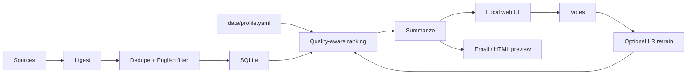

# DailyDigest

DailyDigest is a personalized morning research and news digest. It pulls from journals, preprint servers, biotech industry feeds, regulatory sources, and world news; ranks everything against your profile; summarizes the best items; and gives you a calm local UI for reading and feedback.

It is built for researchers who want signal without opening 40 tabs before breakfast.

**Status:** public-release hardened local app. Verified with `119` passing tests. See [docs/STATUS.md](docs/STATUS.md).

## Features

- One-command local web app with `./scripts/start.sh`
- First-run setup wizard for name, research profile, keywords, downweights, digest size, and summarizer backend
- Broad source coverage: journals, bioRxiv/medRxiv/arXiv, PubMed/OpenAlex, FDA/ClinicalTrials.gov, biotech news, and world news
- Profile-aware ranking with local embeddings, source-quality boosts, novelty signals, freshness gates, cross-source dedupe, and anti-promo penalties
- SQLite embedding cache so repeated brews only embed new or changed items
- Good / Neutral / Bad feedback saved instantly
- Optional learned ranking after enough Good/Bad votes and `uv run dd vote --train`
- Extractive summaries by default, with optional OpenAI-compatible API, Claude Code CLI, or Codex CLI backends
- Dry-run HTML previews and optional Resend email delivery
- Local-first safety: loopback-only web server, CSRF-protected write routes, escaped templates, ignored user profile/data

## Quickstart

```bash
git clone <your-repo-url>
cd dailydigest
./scripts/start.sh
```

Open `http://127.0.0.1:8765`. First-time users go to setup, which writes the local profile to `data/profile.yaml`, updates `.env`, and starts a dry-run brew with live progress.

Run without auto-opening a browser:

```bash
NO_BROWSER=1 ./scripts/start.sh
```

DailyDigest expects to be run from a repo checkout. `uv` is required; the startup script will tell you if it is missing.

## First-Run Tutorial

1. Start the app with `./scripts/start.sh`.
2. Fill out Settings with your bio and interest keywords.
3. Choose `Extractive` for the easiest first run. It needs no login or API key.
4. Click `Brew my morning cup of tea`.
5. Read the digest and mark entries Good, Neutral, or Bad.

Good and Bad votes can improve future ranking after retraining. Neutral only marks an item reviewed.

## Ranking Quality

DailyDigest balances personal topic fit with editorial quality. Research items from top journals such as Nature, Science, Cell, NEJM, and The Lancet get a reputation lift, while lower-prestige sources need strong relevance plus novelty to break into the digest. Ranking candidates are freshness-filtered, deduped across sources, and checked for promotional wording so stale items, repeated papers, and press-release-style posts are pushed below independent, substantive coverage.

You can tune source hints in `config/sources.yaml` with `quality_tier`, `prestige_score`, `impact_floor`, and `promo_risk`. Exact impact factors are not fetched during brewing; the app uses stable local tiers to stay fast and reproducible.

## Summarizer Backends

| Backend | Setup | Best for |
|---|---|---|
| `extractive` | None | First run, offline use, zero cost |
| `api` | `LLM_BASE_URL`, `LLM_API_KEY`, `LLM_MODEL` | OpenAI-compatible hosted models |
| `claude_code` | Local `claude` CLI installed and logged in | Using a Claude subscription locally |
| `codex` | Local `codex` CLI installed and logged in | Using an OpenAI/Codex login locally |

Setup detects whether `claude` or `codex` are on `PATH`. If a CLI is installed but not logged in, the app may only discover that during brew time; failed batches fall back to extractive summaries instead of aborting the digest.

## Common Workflows

Preview a static HTML digest:

```bash
uv sync
uv run dd run-all --dry-run
```

Send a real email digest:

```bash
# Fill RESEND_API_KEY and DIGEST_TO in .env first.
uv run dd run-all
```

Retrain ranking from feedback:

```bash
uv run dd vote --train
```

Run only at the configured local digest hour:

```bash
uv run dd run-all --gate
```

## CLI Reference

```bash
uv run dd ingest                  # Pull all sources into SQLite
uv run dd rank                    # Print top ranked recent items
uv run dd run-all                 # Full pipeline + email send
uv run dd run-all --dry-run       # Render HTML to data/, no email
uv run dd run-all --backfill 7    # Widen recency window
uv run dd vote "+R3 R7 -I5"       # Record label-based feedback
uv run dd vote --train            # Train learned ranker, needs >=30 Good/Bad votes
uv run dd prune                   # Delete old items
```

## Project Map



## Documentation

- [CLAUDE.md](CLAUDE.md) - architecture, conventions, and design notes
- [docs/STATUS.md](docs/STATUS.md) - current state and verification
- [docs/CHANGELOG.md](docs/CHANGELOG.md) - build log and fixes
- [docs/llm-backends.md](docs/llm-backends.md) - backend tradeoffs
- [docs/domain-setup.md](docs/domain-setup.md) - Resend sender domain setup

## Branches

- `main` is the clean public release branch for users.
- `dev` is the active development branch for ongoing work before release.
- Local agent folders such as `.claude/` and `.codex/`, plus `.env`, `data/`, and personal profiles, stay ignored and should not be committed.

## Cost

Typical personal use can stay very cheap:

- Local embeddings and SQLite: free
- Cached item embeddings are small, roughly 1.5 KB per item with the default model, and are pruned with old items
- GitHub Actions cron: free tier
- Resend daily email: free tier
- LLM summaries: optional, often a few dollars/month or zero with extractive mode

## License

Personal project. No license attached.
